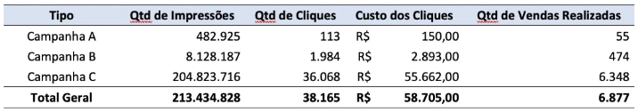
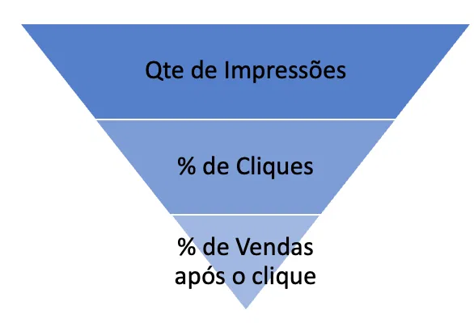

# Vendas em uma Startup

O Marketing Digital tomou conta da indústria de varejo. Com isso, a cada campanha de marketing para promover uma marca ou mesmo para vender os produtos, muitos dados são gerados pelas principais plataformas deste tipo de serviço. Após a pesquisa de mercado realizada, a startup desenvolveu seu produto usando metodologias ágeis e concluiu seu MVP (Minimum Viable Product: Versão inicial de um produto) que já entrega valor para o cliente e permite receber feedback para os próximos ciclos de melhoria). Após o lançamento do MVP, a startup iniciou sua campanha de marketing na plataforma de anúncios do Facebook.

O objetivo desta campanha era direcionar os leads (potenciais clientes) para sua landing page (formato de página de internet focada em determinada ação. Ex: Venda de um produto, assinatura em uma newsletter, download de um e-book etc.). Uma vez na landing page, os clientes poderiam comprar o produto. Após 2 meses de campanha de marketing, a startup recebeu os dados disponíveis na plataforma para estudar a performance das campanhas.

Segue um resumo dos resultados:

Como é possível observar, a startup recebeu 38.165 cliques nos anúncios do **Facebook**, o que custou mais de R$ 58 mil reais para a empresa. O resultado das 3 campanhas foi a venda de 6.877 cursos online.

Para melhores resultados, assim como qualquer empresa, a startup precisa aumentar as vendas e/ou diminuir os custos para maximizar o lucro da operação.

Com base nisso, você, como um(a) bom(a) analista de dados, precisa identificar o melhor perfil de cliente para ajustar o público em que os anúncios da próxima campanha serão vinculados. Portanto, o objetivo deste trabalho de **Analytics** é:

**Como maximizar o lucro da startup aumentando as vendas dos cursos e/ou diminuindo os custos de marketing com as campanhas?**

Algumas informações importantes para iniciar a análise:

- Valor de venda do curso online: R$ 85 reais
- Verba de marketing para a próxima campanha: R$ 20 mil reais
- É mais interessante realizar a análise com as campanhas que geraram mais dados (princípio da teoria frequentista).

Sugestão de roteiro para chegar à uma boa solução:

1. Calcule os KPI’s necessários para essa otimização. Seguem alguns:

   - Faturamento do anúncio.
   - Lucro do anúncio.
   - Click-through-rate (CTR): Percentual da quantidade de impressões do anúncio que viraram cliques.
   - Taxa de Conversão (TC): Percentual da quantidade de cliques que viraram vendas.
   - Custo por clique (CPC): Custo de cada clique realizado pelos clientes.
   - Custo por conversão (CC): Custo da campanha de marketing que cada venda gerou.
   - Retorno sobre investimento (ROI): (Faturamento - custo de marketing ) divido pelo custo de marketing de cada anúncio. **Esta é uma as variáveis mais importantes para maximizar o lucro da startup.**

2. Realize uma boa análise exploratória. Para isso, é importante:

   - Construir tabelas de frequência para cada variável qualitativa;
   - Construir histogramas de cada uma das variáveis quantitativas;
   - Calcular medidas resumo para cada uma das variáveis quantitativas;
   - Medir a associação entre as variáveis quantitativas. Ex: CTR, TC, CPC, CC e ROI.
   - Medir a associação entre as variáveis quantitativas e qualitativas. Ex: ROI x Idade, ROI x Sexo, ROI x Interesses.

3. Algumas perguntas para se inspirar:

   - Qual o “funil de vendas”\* geral? Sem considerar segmentações de idade, sexo ou interesses, qual o valor de investimento necessário para dobrar as vendas?
   - É possível afirmar que quanto maior o investimento em campanhas, maior a quantidade de vendas? Se sim, não existe desperdício de dinheiro? Ou seja, investimento em determinados perfis que clicam mas não compram?
   - Existe algum perfil de cliente que gera maior ROI ? Ex: Mulheres de determinada idade que se interessam por determinado assunto.

\* **Funil de vendas**: É um conceito muito utilizado para definir a quantidade de leads que geram o volume de esperado de vendas.

**O que deve ser feito?**

Uma sugestão de verba que aloca os R$ 20 mil reais para cada combinação de Idade, Interesse e Sexo do público alvo. Além disso, é importante mostrar as análises que suportaram essa decisão.

Métricas por impressão
pagamento por impressão
CPM custo por mil impressões (Quão caro é anunciar pra este público)
Lucro x venda x roi x impressões
