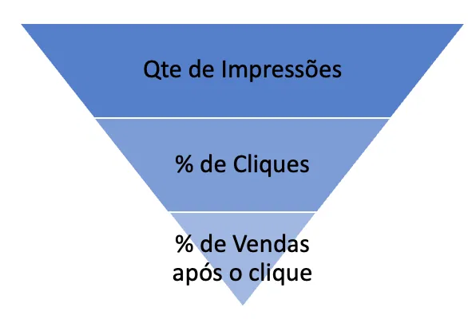

Sugestão de roteiro para chegar à uma boa solução:

1. Calcule os KPI’s necessários para essa otimização. Seguem alguns:

   - Faturamento do anúncio.
   - Lucro do anúncio.
   - Click-through-rate (CTR): Percentual da quantidade de impressões do anúncio que viraram cliques.
   - Taxa de Conversão (TC): Percentual da quantidade de cliques que viraram vendas.
   - Custo por clique (CPC): Custo de cada clique realizado pelos clientes.
   - Custo por conversão (CC): Custo da campanha de marketing que cada venda gerou.
   - Retorno sobre investimento (ROI): (Faturamento - custo de marketing ) divido pelo custo de marketing de cada anúncio. **Esta é uma as variáveis mais importantes para maximizar o lucro da startup.**

2. Realize uma boa análise exploratória. Para isso, é importante:

   - Construir tabelas de frequência para cada variável qualitativa;
   - Construir histogramas de cada uma das variáveis quantitativas;
   - Calcular medidas resumo para cada uma das variáveis quantitativas;
   - Medir a associação entre as variáveis quantitativas. Ex: CTR, TC, CPC, CC e ROI.
   - Medir a associação entre as variáveis quantitativas e qualitativas. Ex: ROI x Idade, ROI x Sexo, ROI x Interesses.

3. Algumas perguntas para se inspirar:

   - Qual o “funil de vendas”\* geral? Sem considerar segmentações de idade, sexo ou interesses, qual o valor de investimento necessário para dobrar as vendas?
   - É possível afirmar que quanto maior o investimento em campanhas, maior a quantidade de vendas? Se sim, não existe desperdício de dinheiro? Ou seja, investimento em determinados perfis que clicam mas não compram?
   - Existe algum perfil de cliente que gera maior ROI ? Ex: Mulheres de determinada idade que se interessam por determinado assunto.

\***Funil de vendas**: É um conceito muito utilizado para definir a quantidade de leads que geram o volume de esperado de vendas.

Métricas por impressão

pagamento por impressão

CPM custo por mil impressões (Quão caro é anunciar pra este público)

Lucro x venda x roi x impressões
